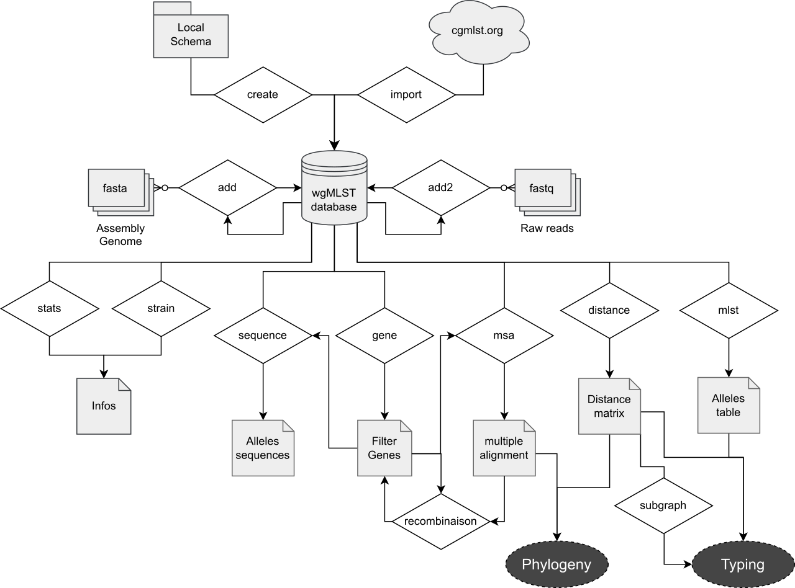

.. _cgmlst:

******************
cg/wgMLST analysis
******************

A workflow analysis of cg/wgMLST is performed using a series of Python
scripts described below.

.. toctree::
   :maxdepth: 1

   cgmlst/initialise
   cgmlst/add
   cgmlst/check
   cgmlst/export_res
   cgmlst/export_seq
   cgmlst/other_analysis

	
   pyMLST architecture for cg/wgMLST analysis

All avalaible commands can be listed using help fonction:

.. code-block:: bash

   wgMLST --help

   Usage: wgMLST [OPTIONS] COMMAND [ARGS]...

   Whole/Core genome MLST analysis.
   
   Commands:
   add            Adds a strain GENOME to the wgMLST DATABASE.
   add2           Adds a strain from FASTQS(.gz) reads to the wgMLST...
   create         Creates a wgMLST DATABASE from a template COREGENE.
   distance       Extracts a distance matrix from a wgMLST DATABASE.
   gene           Extracts a list of genes from a wgMLST DATABASE.
   import         Creates a wgMLST DATABASE from an online resource.
   mlst           Extracts an MLST table from a wgMLST DATABASE.
   msa            Computes Multiple Sequence Alignment from a wgMLST...
   recombination  Searches potential gene recombinations from wgMLST...
   remove         Removes STRAINS or GENES from a wgMLST DATABASE.
   sequence       Extracts sequences from a wgMLST DATABASE.
   stats          Extracts stats from a wgMLST DATABASE.
   strain         Extracts a list of strains from a wgMLST DATABASE.
   subgraph       Searches group of strains at a DISTANCE threshold.
