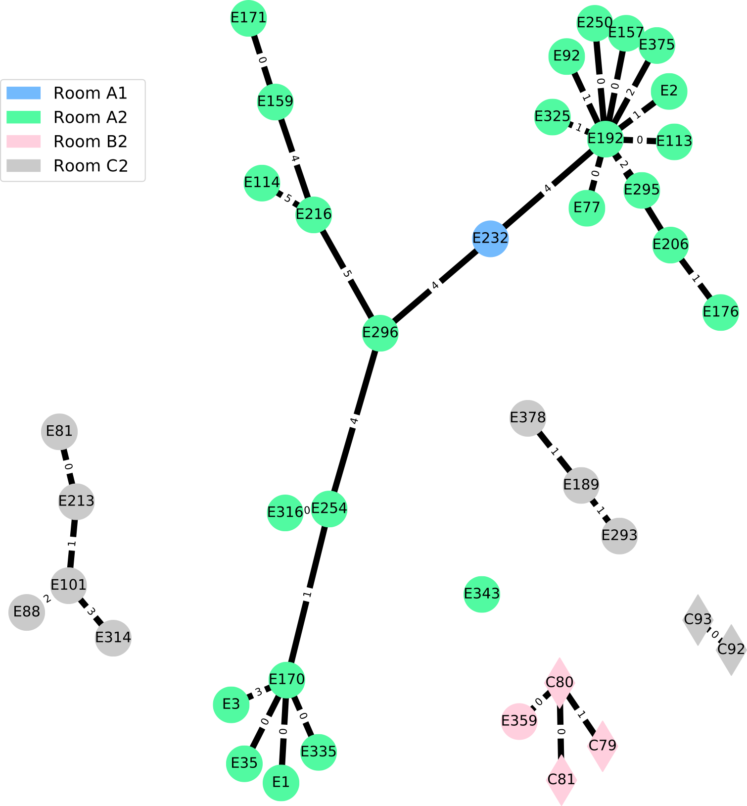

.. _cgmlst_other_analysis:

.. toctree::
    :glob:

========================
Other analysis available
========================

From the results obtained with cg/wgMLST analysis, you can proceed to
further analysis.

.. _cgmlst_other_subgraph:

Subgraph
========

The subgraph command performs a simple hierarchical clustering to
group strains with a distance below the threshold.

	
   MST representation of subgraph analysis at a threshold of 10.

You need:

:DISTANCE: The distance matrix obtained with :ref:`distance <cgmlst_export_distance>` command.

.. code-block:: bash

   wgMLST subgraph -h
   Usage: wgMLST subgraph [OPTIONS] DISTANCE
   
   Searches group of strains at a DISTANCE threshold.
   
   Options:
   -o, --output FILENAME             Output group files (default:stdout).
   -t, --threshold INTEGER           Minimum distance to conserve for extraction
                                     of group (default:50).
   -e, --export [list|count|group]   Export type (default:list).

   
.. _cgmlst_other_recombination:

Recombination
=============

The recombination command determines the number of different positions
in the multiple alignment. You can use the result to define a
threshold and the final list of genes without potential recombination.

.. code::

   #Gene   Mutation  Lenght  mutation per 100 base
   PA0001     1       1545    0.064
   PA0002     1       1104    0.090
   PA0004     1       2421    0.041
   PA0010     1       552     0.181
   PA0011     0       888     0.0
   PA0022     1       558     0.179
   PA0038     1       216     0.462
   PA0062     1       417     0.239
   PA0065     1       666     0.150
   ...

You need:

:GENES: List of genes used for export MSA and obtained with :ref:`gene
		<gene_check>` command.
:ALIGNMENT: The Multiple Sequence Alignment obtained with :ref:`msa <cgmlst_export_msa>` command.

.. code-block:: bash
   
   wgMLST recombination -h
   Usage: wgMLST recombination [OPTIONS] GENES ALIGNMENT
   
   Searches potential gene recombinations from wgMLST database export.
   
   Options:
   -o, --output FILENAME  Output number of variations by genes
                          (default:stdout).
   
.. warning::

   The algorithm is designed to find recombination on closed strains
   and could not work correctly on more diverse ST.

